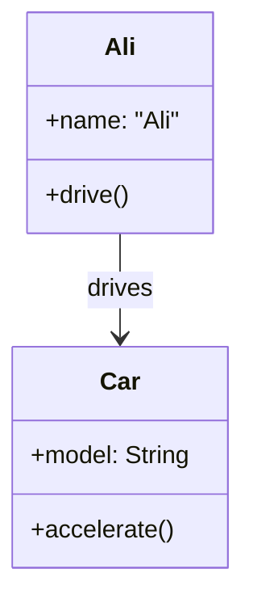
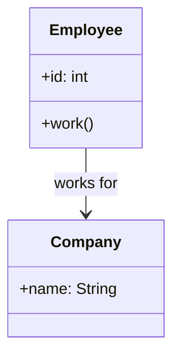
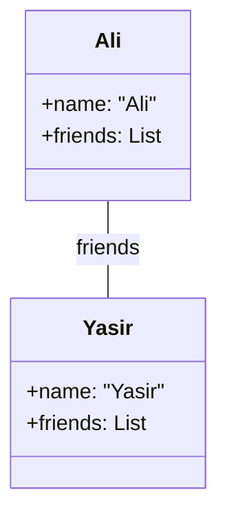
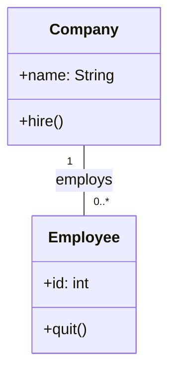
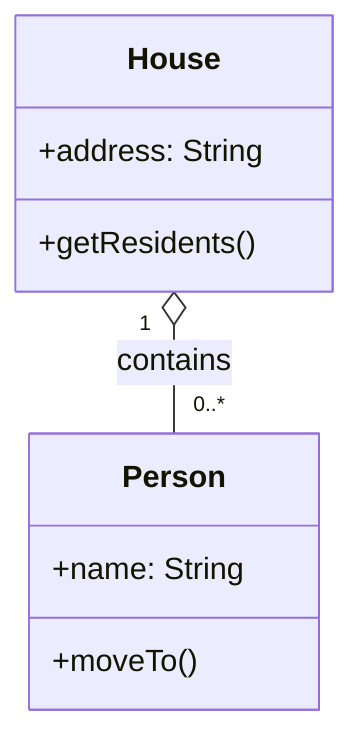
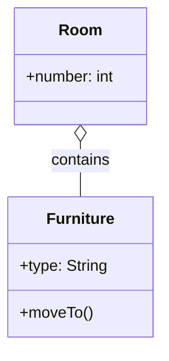
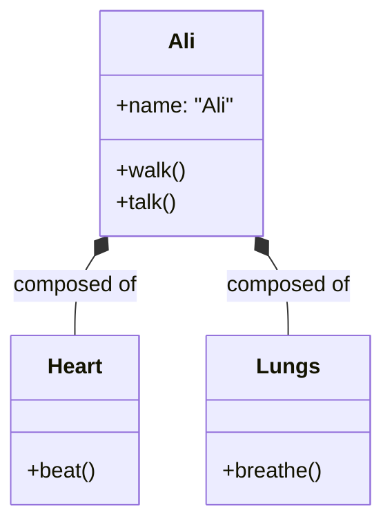
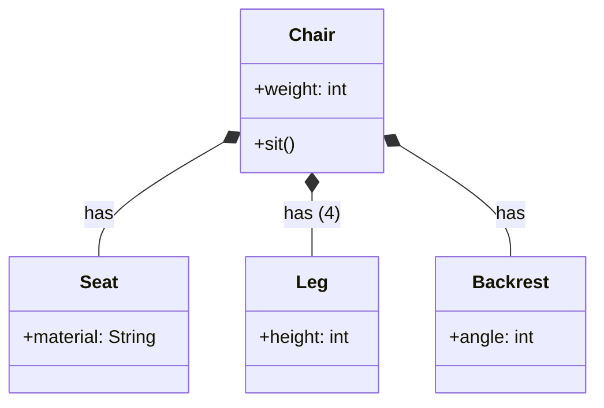

# Association, Aggregation and  Composition

## 1. Association

### What is Association?

In general terms, **Association** is a relationship between two independent entities. It describes how they are connected or how they interact with each other. For example, "a doctor treats a patient" or "a student attends a course" – these are associations because they describe a meaningful connection between separate things.

### Association in Object-Oriented Programming (OOP)

In OOP, **Association** is a relationship where one object uses or interacts with another object. Both objects exist independently, and neither owns the other. They simply have a reference (pointer or variable) that allows them to communicate.

**Key characteristics in OOP:**
- Objects have independent lifecycles (creating/deleting one does not affect the other).
- It represents a "uses-a" or "knows-a" relationship.
- It is the weakest form of object relationship.

### Kinds of Simple Association 

| Type | Description | UML Notation |
| :--- | :--- | :--- |
| **One-way Association** | Navigation is possible in only one direction. | Arrow `-->` |
| **Two-way Association** | Navigation is possible in both directions. | Line `---` |

### Examples from your list

#### Example 1: One-way Association – "Ali drives his Car"

Ali knows about his Car, but the Car does not need to know who is driving it.

#### Example 2: One-way Association – "Employee works for Company"

The Employee knows which Company they work for, but the Company may not track individual employees directly.

#### Example 3: Two-way Association – "Yasir is a friend of Ali" AND "Ali is a friend of Yasir"

Both objects must know each other. If Ali knows Yasir, Yasir must also know Ali.

#### Example 4: Binary Association – "Company employs employees"

This shows a relationship between two classes with multiplicity (one Company can employ many Employees).

---

## 2. Aggregation

### What is Aggregation?

In general terms, **Aggregation** is a collection or assembly of items. It implies that something is made up of a group of other things, but the individual items can exist on their own. For example, a "bunch of grapes" – the bunch is the aggregate, but each grape can exist independently of the bunch.

### Aggregation in Object-Oriented Programming (OOP)

In OOP, **Aggregation** is a special form of association that represents a "has-a" relationship, but a **weak** one. The container (whole) holds references to the contained objects (parts), but the parts can exist independently even if the container is destroyed.

**Key characteristics in OOP:**
- Represents a "whole-part" relationship where the part can exist without the whole.
- The part's lifecycle is **independent** of the whole.
- If the container is destroyed, the parts continue to exist.
- UML Notation: Unfilled (hollow) diamond `◇--` on the container side.

### Example from your list – "Ali lives in a House"

A House contains Ali as a resident, but Ali is not an intrinsic part of the House. Ali can move to another house or live elsewhere independently.

### Additional Example – "Furniture in a Room"

Furniture is not an intrinsic part of a room. Furniture can be shifted to another room.

**Why Aggregation is weaker:**
- Furniture can exist without a Room (e.g., in a warehouse).
- Ali can exist without a House (e.g., in an apartment or another city).
- The aggregate object (Person, Furniture) has its own independent identity and lifecycle.

---

## 3. Composition

### What is Composition?

In general terms, **Composition** is the act of putting together parts to form a whole, where the parts have no meaningful existence without the whole. For example, a "human body" composed of "organs" – a heart cannot function or exist meaningfully outside a body.

### Composition in Object-Oriented Programming (OOP)

In OOP, **Composition** is a stronger form of aggregation where the part objects **cannot exist independently** of the whole object. The whole is responsible for creating and destroying its parts.

**Key characteristics in OOP:**
- Represents a "part-of" relationship where the part belongs exclusively to the whole.
- The part's lifecycle is **dependent** on the whole.
- If the container is destroyed, the parts are destroyed automatically.
- UML Notation: Filled (solid) diamond `*--` on the container side.

### Example – "Ali is composed of body parts"

Ali is made up of different body parts like Heart and Lungs. These parts cannot exist independent of Ali.

### Example – "Composition of a Chair"

A chair is composed of its parts: Seat, Legs, and Backrest. These parts have no meaningful existence without the chair.

**Why Composition is stronger:**
- A Heart cannot exist independently without a body (Ali).
- Chair Legs cannot exist meaningfully without the Chair.
- If Ali is destroyed (object removed), the Heart and Lungs cease to exist logically.
- The parts are created when the whole is created, and destroyed when the whole is destroyed.

---

## Comparison Table

| Feature | Association | Aggregation | Composition |
| :--- | :--- | :--- | :--- |
| **Relationship type** | "Uses-a" / "Knows-a" | "Has-a" (weak) | "Part-of" (strong) |
| **Lifecycle dependency** | None | None (independent) | Complete (dependent) |
| **Can part exist without whole?** | Yes (completely independent) | Yes | No |
| **UML Diamond** | No diamond | Unfilled (hollow) diamond | Filled (solid) diamond |
| **Ownership** | No ownership | Weak ownership | Strong ownership |
| **Example** | Ali drives Car | Ali lives in House | Ali has a Heart |

---
