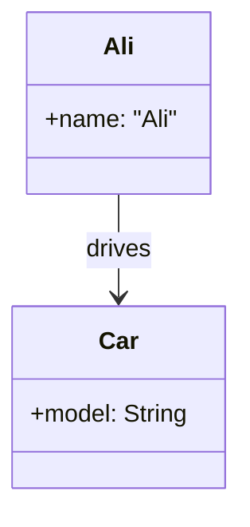
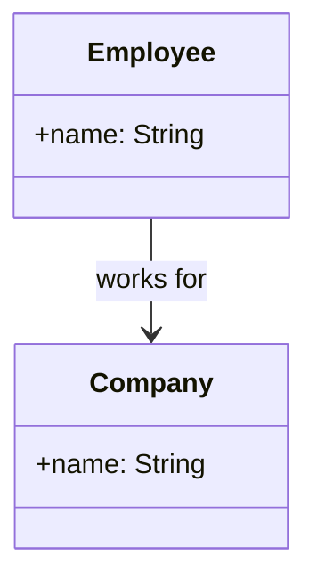
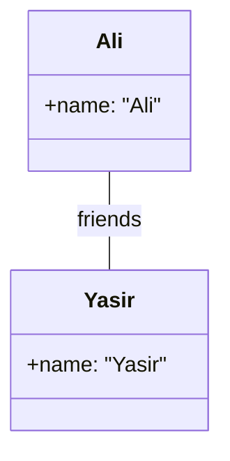
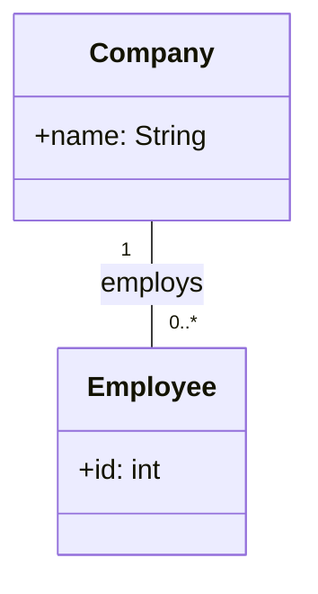
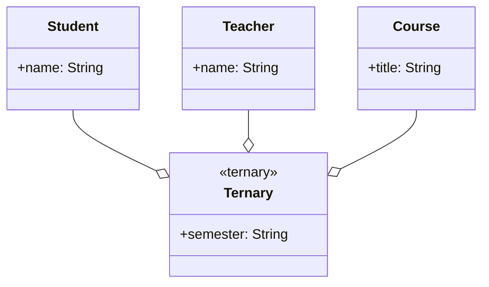
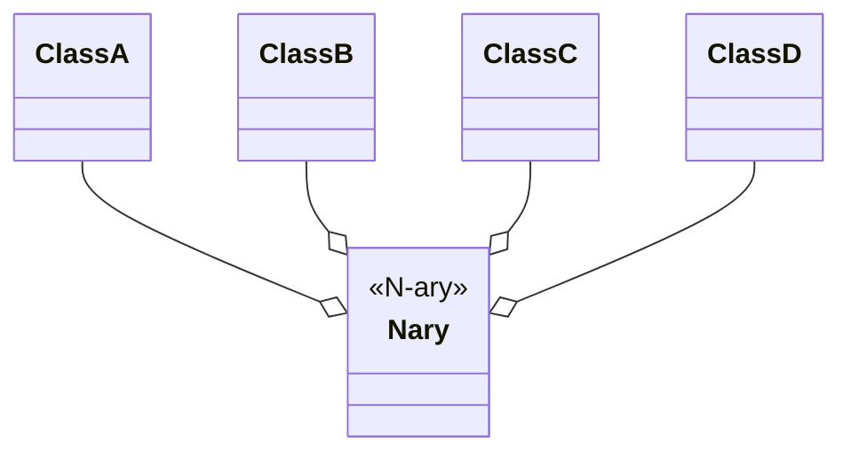
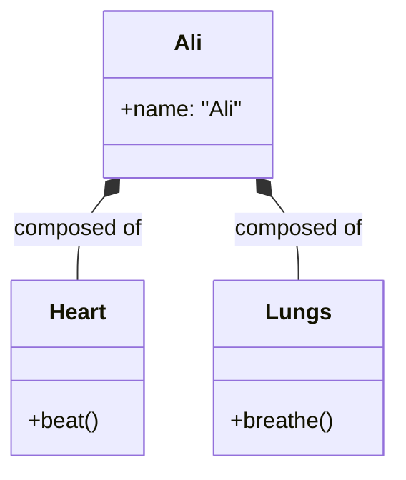
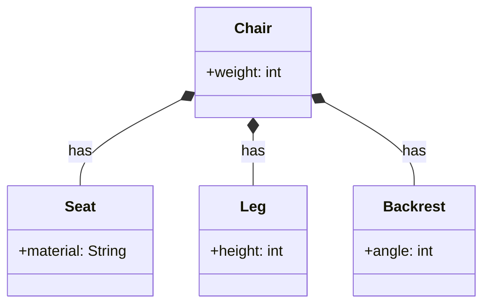
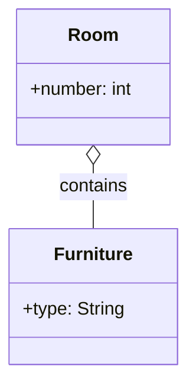
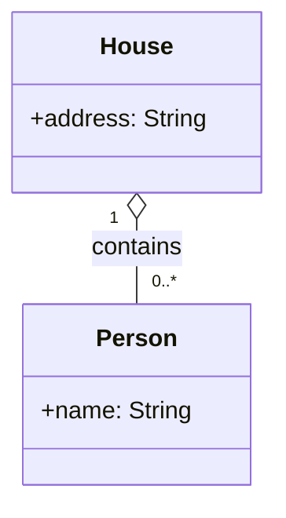

# Associations Aggregation And Composition

---
## Association

### What is Association?
Association is a connection between two separate things. For example, "a doctor treats a patient" – this is an association because it describes a relationship between two different people.

## Association in OOP
Objects in an object model interact with each other.                                                                                          
Usually an object provides services to several other objects.                                                                                 
An object keeps associations with other objects to delegate tasks.                                                                           

**Key points:**
- Objects have independent lifetimes
- One object keeps a reference to another
- Neither object owns the other

## Kinds of Association
There are two main kinds of association:

| Kind | Description |
| :--- | :--- |
| **Class Association** | Inheritance (is-a relationship) |
| **Object Association** | Relationship between objects (uses-a, has-a) |

Object Association includes:
- Simple Association
- Composition
- Aggregation

---

## Simple Association
Is the weakest link between objects                                                                                                           

Is a reference by which one object can interact with some other object                                                                        

Is simply called as “association”                                                                                                          

---

## Kinds of Simple Association

### With respect to navigation

| Type | Description | UML Symbol |
| :--- | :--- | :--- |
| **One-way Association** | Navigation is possible in only one direction | Arrow `-->` |
| **Two-way Association** | Navigation is possible in both directions | Line `---` |

### With respect to number of objects

| Type | Description |
| :--- | :--- |
| **Binary Association** | Associates objects of exactly two classes |
| **Ternary Association** | Associates objects of exactly three classes |
| **N-ary Association** | Association between 3 or more classes (very rare) |

---

## Examples of Simple Association

### One-way Association

Ali knows about his Car. The Car does not need to know about Ali.

### One-way Association 

The Employee knows which Company they work for.

### Two-way Association 

Both objects know each other. Denoted by a line between the associated objects.

### Binary Association  

Associates objects of exactly two classes. Denoted by a line or an arrow between the associated objects.

### Ternary Association 

Associates objects of exactly three classes. Denoted by a diamond with lines connected to the associated objects.

### N-ary Association

An association between 3 or more classes. Practical examples are very rare.

---

## Composition

### What is Composition?

Composition is when parts come together to form a whole, but the parts have no meaning without the whole. For example, a "human body" made of "organs" – a heart cannot exist outside a body.

### Composition in OOP

In OOP, Composition is a stronger relationship. An object may be composed of other smaller objects. The relationship between the "part" objects and the "whole" object is known as Composition.

**Key points:**
- The part belongs exclusively to the whole
- Composed object becomes a part of the composer
- Composed object cannot exist independently
- If the whole is destroyed, the parts are also destroyed
- Denoted by a line with a **filled diamond** head towards the composer object

### Example – Composition of Ali

Ali is made up of different body parts. They cannot exist independent of Ali.

### Example – Composition of Chair

Chair's body is made up of different parts. They cannot exist independently.

### Why Composition is Stronger

- Composed object becomes a part of the composer
- Composed object cannot exist independently

---

## Aggregation

### What is Aggregation?

Aggregation is a collection of items where each item can exist on its own. For example, a "bunch of grapes" – the bunch is the collection, but each grape can exist without the bunch.

### Aggregation in OOP

In OOP, Aggregation is a weaker relationship. An object may contain a collection (aggregate) of other objects. The relationship between the container and the contained object is called Aggregation.

**Key points:**
- The part can exist without the whole
- Aggregate object is not an intrinsic part of the container
- Aggregate object can exist independently
- If the container is destroyed, the parts continue to exist
- Denoted by a line with an **unfilled diamond** head towards the container

### Example – Aggregation

Furniture is not an intrinsic part of a room. Furniture can be shifted to another room, and so can exist independent of a particular room.

### Example – Ali lives in a House

Ali is not an intrinsic part of a house. He can move to another house.

### Why Aggregation is Weaker

- Aggregate object is not a part of the container
- Aggregate object can exist independently

---

## Summary Table

| Kind | What it means | Can parts exist alone? | UML Diamond | Example |
| :--- | :--- | :--- | :--- | :--- |
| **Simple Association** | Object uses another object | Yes (fully independent) | No diamond | Ali drives Car |
| **Aggregation** | Container holds objects | Yes (weak ownership) | Unfilled (hollow) | Ali lives in House |
| **Composition** | Whole made of parts | No (strong ownership) | Filled (solid) | Ali has a Heart |

---

